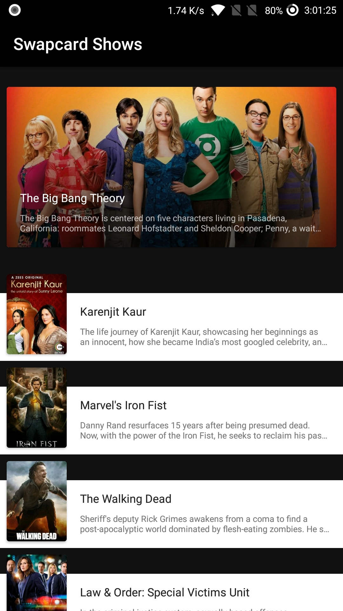

# Swapcard shows
 


# ScreenShots
<p float="left">
  
  
  
  
  
  
  
</p>


## Development process
Based on Test-driven development.<br>
1. API Service -> API Service Unit Test with api response mock files
2. DAO -> DAO Unit Test
3. ViewModel -> ViewModel Unit Test
4. DI & Refactoring
5. Implmentating UI & Layouts <br><br>


## Specs & Open-source libraries
- Minimum SDK 14
- 100% Java based
- MVVM Architecture
- Architecture Components (Lifecycle, LiveData, ViewModel, Room Persistence)
- Material Design & Animations
- The Movie DB API
- [Retrofit2 & Gson](https://github.com/square/retrofit) for constructing the REST API
- [OkHttp3](https://github.com/square/okhttp) for implementing interceptor, logging and mocking web server
- [Glide](https://github.com/bumptech/glide) for loading images
- [Timber](https://github.com/JakeWharton/timber) for logging
- Ripple animation, Shared element transition

ToDo List : 

- [ ] Support Similar Tv Shows 


# License
```xml
MIT License

Copyright (c) 2018 Saket Kumar

Permission is hereby granted, free of charge, to any person obtaining a copy
of this software and associated documentation files (the "Software"), to deal
in the Software without restriction, including without limitation the rights
to use, copy, modify, merge, publish, distribute, sublicense, and/or sell
copies of the Software, and to permit persons to whom the Software is
furnished to do so, subject to the following conditions:

The above copyright notice and this permission notice shall be included in all
copies or substantial portions of the Software.

THE SOFTWARE IS PROVIDED "AS IS", WITHOUT WARRANTY OF ANY KIND, EXPRESS OR
IMPLIED, INCLUDING BUT NOT LIMITED TO THE WARRANTIES OF MERCHANTABILITY,
FITNESS FOR A PARTICULAR PURPOSE AND NONINFRINGEMENT. IN NO EVENT SHALL THE
AUTHORS OR COPYRIGHT HOLDERS BE LIABLE FOR ANY CLAIM, DAMAGES OR OTHER
LIABILITY, WHETHER IN AN ACTION OF CONTRACT, TORT OR OTHERWISE, ARISING FROM,
OUT OF OR IN CONNECTION WITH THE SOFTWARE OR THE USE OR OTHER DEALINGS IN THE
SOFTWARE.

```
